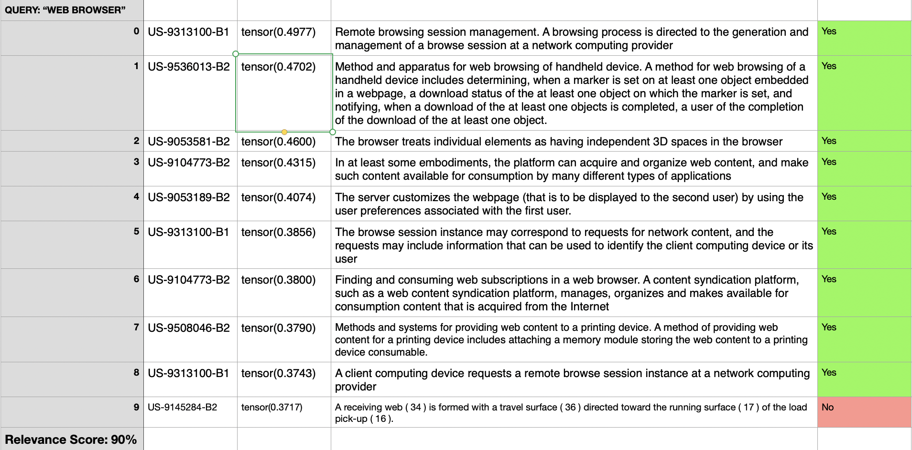

# Patent Semantic Search Experiments:

In this repo, I experiment with some simple methods of performing semantic search with a completely unlabelled dataset of Patents. This dataset doesn't have any marked keywords or user click-based data to score patent relevance.


## Method # 1: Baseline:

In the baseline approach, we use a simple tf-idf computation to rank patent documents in the dataset. We use spacy to filter out stop words and lemmatize all other words before searching. TF-IDF scores are computed as follows:

* $TF(term)$: # of occurrences of term within the document
* $D(term)$: # of documents with at least 1 occurrence of the term 
* $N$: total # docs.

$$TF\_IDF = TF(term) * \log(\frac{N}{D(term)}) $$

$$ TF\_IDF(query) = \Sigma_{term \in query}\ TF\_IDF(term)$$


Usage:

```python
dataset_path = Path("path/to/data.csv")
query = "patent search query"

output_df = tf_idf_search(query, p)
```


* Initially, this code searches through the dataset to pre-compute TF's and IDF's for each term and each document in the dataset.
* Subsequently, upon entering the user search query, it computes the combined TF_IDF of the query with every document in the dataset, and returns the best scoring solutions.


Notes:

* This is a very simple baseline method. It can be very error prone, since it is not as good at guessing the context of query terms.
* In order to upgrade this, we should try to add custom search logic, i.e. searching for full phrases, and using boolean operations between different search terms.


## Method # 2: Sentence Embedding Semantic Search:

In this approach, we utilize a pre-trained deep learning model via HuggingFace. Specifically, we use the very compact and very accurate sentence transformer "MiniLM-L6-v2"; read more about it [here](https://huggingface.co/sentence-transformers/all-MiniLM-L6-v2).

* A "sentence transformer" is a large language model (LLM) which tries to capture and encode the "intent" of a sentence as closely as possible.
* How we use it: 
  1. Preprocessing: create an embedding from the title & abstract text of each patent. 
  2. At search time: create an embedding of the query. 
     1. Then, utilize a "vector similarity search" to match the query embedding to the 10 closest "title & abstract" embeddings.
     2. Vector similarity search is provided by sentence_transformers library in huggingface. It first computes cosine similarity of the query with the entire corpus, and then sorts the cosine-similarity scores to find the top 10 scoring sentences.

Usage:

```python
corpus_data_path = Path("path/to/datacsv/or/datapkl")
# this either: 1) builds the corpus of vector embeddings corresponding to the search corpus (.csv), or 2) loads a pickled corpus of embeddings (.pkl)
patent_search = corpus_sem_search(corpus_data_path, True)

# next, try performing a query
top_results = patent_search.search_corpus("query text")
```


## Results: Comparison of Methods

Below, we show the performance of these two methods on a few different test queries. 

Notes:

* the evalutation task was to find the top 10 most relevant patents (based on title & abstract text) 
* the returned results are ranked based on relevance into three categories (this was done by a human evaluator):
  1. relevant to the query topic ***(score=0.1)***
  2. somewhat relevant to the query (document is about a closely related topic) ***(score=0.05)***
  3. not relevant to the query topic ***(score=0)***
* This evaluation task was done on a very small sample size and should not be considered statistically significant. It is only meant to provide a blueprint as to how a task like this can be scored, and to provide a guess into how much semantic search might improve over the baseline, and why.


### Query 1: "Vaping Electronic Cigarette"

* Semantic search


* Baseline


As we can see, the semantic search method surfaced more relevant results, and scored them higher than noisy results.


### Query 2: "Semiautomatic Rifle Gun"

* Semantic search:


* Baseline:


While both methods scored few exact hits, the semantic search method brought in more "somewhat relevant" results as well.


### Query 3: "Web Browser"

* Semantic Search:



* Baseline:


This was a much "easier" query as there were far more relevant results. Still, semantic search has a notable improvement over the baseline.
